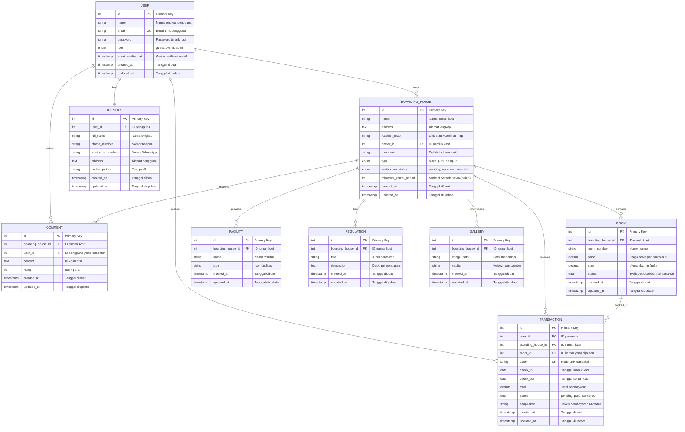

# E-Kos - Sistem Manajemen Rumah Kost

[](https://laravel.com)
[](https://php.net)
[](https://getbootstrap.com)

## 📋 Deskripsi Proyek

E-Kos adalah platform web modern untuk pencarian, booking, dan manajemen rumah kost (boarding house) secara online. Sistem ini menghubungkan pemilik kost dengan pencari kost melalui platform yang terintegrasi dengan sistem pembayaran dan notifikasi.

### 🎯 Tujuan Utama

- Memudahkan pencari kost dalam menemukan hunian yang sesuai dengan kebutuhan
- Membantu pemilik kost dalam mengelola properti dan transaksi secara digital
- Menyediakan sistem pembayaran yang aman dan transparan
- Meningkatkan efisiensi proses pencarian dan booking kost

### ✨ Fitur Utama

- **🔍 Pencarian dan Filter**: Pencarian kost berdasarkan lokasi, harga, fasilitas, dan kategori
- **🏠 Manajemen Kost**: Sistem manajemen lengkap untuk pemilik kost
- **💳 Pembayaran Terintegrasi**: Integrasi dengan Midtrans untuk pembayaran online
- **📱 Notifikasi WhatsApp**: Notifikasi otomatis via WhatsApp menggunakan Fonnte
- **📊 Dashboard Admin**: Panel admin untuk verifikasi dan monitoring
- **🖼️ Galeri Foto**: Upload dan tampilan foto kost
- **📋 Sistem Booking**: Booking kamar dengan konfirmasi otomatis
- **🔐 Multi-Role Authentication**: Sistem autentikasi dengan multiple role (guest, owner, admin)
- **📈 Activity Logging**: Pencatatan aktivitas sistem menggunakan Spatie Activity Log
- **💾 Backup System**: Sistem backup database otomatis

## 🛠️ Teknologi Stack

### Backend
- **Framework**: Laravel 11.x
- **Bahasa**: PHP 8.2+
- **Database**: MySQL
- **Authentication**: Laravel Sanctum
- **Payment Gateway**: Midtrans
- **WhatsApp API**: Fonnte
- **Image Optimization**: Spatie Laravel Image Optimizer
- **Backup**: Spatie Laravel Backup
- **Activity Logging**: Spatie Laravel Activity Log

### Frontend
- **Framework CSS**: Bootstrap 5.2
- **JavaScript**: Vanilla JS + Axios
- **Build Tool**: Vite
- **CSS Preprocessor**: Sass

### Development Tools
- **Package Manager**: Composer (PHP), NPM (Node.js)
- **Code Quality**: Laravel Pint
- **Testing**: PHPUnit
- **Database Seeding**: Laravel Factories

## 🏗️ Arsitektur Aplikasi

### Struktur Database

#### Model Utama
- **User**: Pengguna sistem dengan role (guest, owner, admin)
- **BoardingHouse**: Data rumah kost dengan informasi lengkap
- **Room**: Kamar dalam rumah kost dengan harga dan status
- **Transaction**: Transaksi pemesanan kamar
- **Facility**: Fasilitas yang tersedia di kost
- **Regulation**: Peraturan kost
- **Gallery**: Galeri foto kost
- **Comment**: Sistem komentar dan review
- **Identity**: Data identitas pengguna
- **WebsiteSystem**: Konfigurasi sistem website

#### Entity Relationship Diagram (ERD)

**Diagram Interaktif:**



**Legenda:**
- `||--o{` : One-to-Many relationship
- `||--||` : One-to-One relationship
- `PK` : Primary Key
- `FK` : Foreign Key
- `UK` : Unique Key

**Penjelasan Relasi:**

| Relasi | Tipe | Deskripsi |
|--------|------|-----------|
| USER → BOARDING_HOUSE | One-to-Many | Satu user (owner) dapat memiliki banyak kost |
| USER → TRANSACTION | One-to-Many | Satu user dapat melakukan banyak transaksi |
| USER → IDENTITY | One-to-One | Setiap user memiliki satu data identitas |
| USER → COMMENT | One-to-Many | Satu user dapat menulis banyak komentar |
| BOARDING_HOUSE → ROOM | One-to-Many | Satu kost memiliki banyak kamar |
| BOARDING_HOUSE → FACILITY | One-to-Many | Satu kost memiliki banyak fasilitas |
| BOARDING_HOUSE → REGULATION | One-to-Many | Satu kost memiliki banyak peraturan |
| BOARDING_HOUSE → GALLERY | One-to-Many | Satu kost memiliki banyak foto galeri |
| BOARDING_HOUSE → TRANSACTION | One-to-Many | Satu kost dapat menerima banyak transaksi |
| BOARDING_HOUSE → COMMENT | One-to-Many | Satu kost dapat menerima banyak komentar |
| ROOM → TRANSACTION | One-to-Many | Satu kamar dapat dibooking berkali-kali |

#### Struktur Tabel Detail

**Table: users**
```sql
CREATE TABLE users (
    id BIGINT UNSIGNED AUTO_INCREMENT PRIMARY KEY,
    name VARCHAR(255) NOT NULL,
    email VARCHAR(255) NOT NULL UNIQUE,
    password VARCHAR(255) NOT NULL,
    role ENUM('guest', 'owner', 'admin') NOT NULL DEFAULT 'guest',
    email_verified_at TIMESTAMP NULL,
    created_at TIMESTAMP NULL,
    updated_at TIMESTAMP NULL,
    INDEX idx_role (role),
    INDEX idx_email (email)
);
```

**Table: identities**
```sql
CREATE TABLE identities (
    id BIGINT UNSIGNED AUTO_INCREMENT PRIMARY KEY,
    user_id BIGINT UNSIGNED NOT NULL,
    full_name VARCHAR(255) NOT NULL,
    phone_number VARCHAR(20),
    whatsapp_number VARCHAR(20),
    address TEXT,
    profile_picture VARCHAR(255),
    created_at TIMESTAMP NULL,
    updated_at TIMESTAMP NULL,
    FOREIGN KEY (user_id) REFERENCES users(id) ON DELETE CASCADE,
    INDEX idx_user_id (user_id)
);
```

**Table: boarding_houses**
```sql
CREATE TABLE boarding_houses (
    id BIGINT UNSIGNED AUTO_INCREMENT PRIMARY KEY,
    name VARCHAR(255) NOT NULL,
    address TEXT NOT NULL,
    location_map VARCHAR(500),
    owner_id BIGINT UNSIGNED NOT NULL,
    thumbnail VARCHAR(255),
    type ENUM('putra', 'putri', 'campur') NOT NULL,
    verification_status ENUM('pending', 'approved', 'rejected') DEFAULT 'pending',
    minimum_rental_period INT DEFAULT 1,
    created_at TIMESTAMP NULL,
    updated_at TIMESTAMP NULL,
    FOREIGN KEY (owner_id) REFERENCES users(id) ON DELETE CASCADE,
    INDEX idx_owner_id (owner_id),
    INDEX idx_type (type),
    INDEX idx_verification_status (verification_status)
);
```

**Table: rooms**
```sql
CREATE TABLE rooms (
    id BIGINT UNSIGNED AUTO_INCREMENT PRIMARY KEY,
    boarding_house_id BIGINT UNSIGNED NOT NULL,
    room_number VARCHAR(50) NOT NULL,
    price DECIMAL(12, 2) NOT NULL,
    size DECIMAL(8, 2),
    status ENUM('available', 'booked', 'maintenance') DEFAULT 'available',
    created_at TIMESTAMP NULL,
    updated_at TIMESTAMP NULL,
    FOREIGN KEY (boarding_house_id) REFERENCES boarding_houses(id) ON DELETE CASCADE,
    INDEX idx_boarding_house_id (boarding_house_id),
    INDEX idx_status (status),
    INDEX idx_price (price)
);
```

**Table: transactions**
```sql
CREATE TABLE transactions (
    id BIGINT UNSIGNED AUTO_INCREMENT PRIMARY KEY,
    user_id BIGINT UNSIGNED NOT NULL,
    boarding_house_id BIGINT UNSIGNED NOT NULL,
    room_id BIGINT UNSIGNED NOT NULL,
    code VARCHAR(100) NOT NULL UNIQUE,
    check_in DATE NOT NULL,
    check_out DATE NOT NULL,
    total DECIMAL(12, 2) NOT NULL,
    status ENUM('pending', 'paid', 'cancelled') DEFAULT 'pending',
    snapToken TEXT,
    created_at TIMESTAMP NULL,
    updated_at TIMESTAMP NULL,
    FOREIGN KEY (user_id) REFERENCES users(id) ON DELETE CASCADE,
    FOREIGN KEY (boarding_house_id) REFERENCES boarding_houses(id) ON DELETE CASCADE,
    FOREIGN KEY (room_id) REFERENCES rooms(id) ON DELETE CASCADE,
    INDEX idx_user_id (user_id),
    INDEX idx_boarding_house_id (boarding_house_id),
    INDEX idx_room_id (room_id),
    INDEX idx_status (status),
    INDEX idx_code (code)
);
```

### Struktur Direktori

```
app/
├── Console/           # Artisan commands
├── Exceptions/        # Custom exceptions
├── Helpers/          # Helper functions
├── Http/
│   ├── Controllers/  # Request controllers
│   ├── Middleware/   # HTTP middleware
│   └── Kernel.php
├── Mail/             # Email templates
├── Models/           # Eloquent models
├── Providers/        # Service providers
├── Services/         # Business logic services
└── View/Components/  # Blade components

config/               # Configuration files
database/            # Migrations & seeders
public/              # Public assets
resources/
├── css/            # Stylesheets
├── js/             # JavaScript files
├── sass/           # Sass files
└── views/          # Blade templates

routes/              # Route definitions
storage/             # File storage
```

## 📋 Persyaratan Sistem

### Server Requirements
- **Web Server**: Apache/Nginx
- **PHP**: 8.2 atau lebih tinggi
- **Database**: MySQL 5.7+ / MariaDB 10.3+
- **Node.js**: 16.x atau lebih tinggi (untuk asset compilation)
- **Composer**: Untuk manajemen dependensi PHP
- **Git**: Untuk version control

### Extension PHP yang Dibutuhkan
- `php-curl`
- `php-gd`
- `php-mbstring`
- `php-xml`
- `php-zip`
- `php-bcmath`
- `php-intl`
- `php-fileinfo`
- `pdo_mysql`

## 🚀 Panduan Instalasi

### 1. Persiapan Environment

```bash
# Clone repository
git clone <repository-url>
cd rumah-kost

# Copy environment file
cp .env.example .env
```

### 2. Instalasi PHP Dependencies

```bash
# Install composer dependencies
composer install

# Generate application key
php artisan key:generate
```

### 3. Konfigurasi Database

Edit file `.env` dan sesuaikan konfigurasi database:

```env
DB_CONNECTION=mysql
DB_HOST=127.0.0.1
DB_PORT=3306
DB_DATABASE=rumah_kost
DB_USERNAME=your_username
DB_PASSWORD=your_password
```

### 4. Migrasi Database

```bash
# Jalankan migrasi
php artisan migrate

# Seed database (opsional)
php artisan db:seed
```

### 5. Instalasi Node Dependencies

```bash
# Install npm dependencies
npm install

# Build assets untuk production
npm run build

# Atau untuk development
npm run dev
```

### 6. Konfigurasi Payment Gateway (Midtrans)

Edit file `.env` dan tambahkan konfigurasi Midtrans:

```env
MIDTRANS_SERVER_KEY=your_server_key
MIDTRANS_CLIENT_KEY=your_client_key
MIDTRANS_IS_PRODUCTION=false
```

### 7. Konfigurasi WhatsApp API (Fonnte)

```env
FONNTE_API_KEY=your_fonnte_api_key
FONNTE_BASE_URL=https://api.fonnte.com
```

### 8. Konfigurasi Email (Opsional)

```env
MAIL_MAILER=smtp
MAIL_HOST=your_smtp_host
MAIL_PORT=587
MAIL_USERNAME=your_email@domain.com
MAIL_PASSWORD=your_email_password
MAIL_ENCRYPTION=tls
MAIL_FROM_ADDRESS=noreply@yourdomain.com
MAIL_FROM_NAME="${APP_NAME}"
```

## 🔧 Konfigurasi Tambahan

### Environment Variables

Buat file `.env` dengan konfigurasi berikut:

```env
APP_NAME="E-Kos"
APP_ENV=local
APP_KEY=base64:your-generated-key
APP_DEBUG=true
APP_URL=http://localhost

LOG_CHANNEL=stack
LOG_DEPRECATIONS_CHANNEL=null
LOG_LEVEL=debug

DB_CONNECTION=mysql
DB_HOST=127.0.0.1
DB_PORT=3306
DB_DATABASE=rumah_kost
DB_USERNAME=your_username
DB_PASSWORD=your_password

BROADCAST_DRIVER=log
CACHE_DRIVER=file
FILESYSTEM_DISK=local
QUEUE_CONNECTION=sync
SESSION_DRIVER=file
SESSION_LIFETIME=120

# Payment Gateway
MIDTRANS_SERVER_KEY=your_server_key
MIDTRANS_CLIENT_KEY=your_client_key
MIDTRANS_IS_PRODUCTION=false

# WhatsApp API
FONNTE_API_KEY=your_fonnte_api_key
```

## 🎯 Penggunaan Aplikasi

### 1. Menjalankan Aplikasi

```bash
# Jalankan server development
php artisan serve

# Akses aplikasi di browser
# http://localhost:8000
```

### 2. Mengakses Fitur Utama

#### Untuk Pengguna (Guest)
- **Pencarian Kost**: Kunjungi halaman utama dan gunakan fitur pencarian
- **Detail Kost**: Klik pada kost untuk melihat detail lengkap
- **Booking**: Login dan lakukan pemesanan kamar
- **Pembayaran**: Sistem akan mengarahkan ke halaman pembayaran Midtrans

#### Untuk Pemilik Kost (Owner)
- **Registrasi**: Daftar sebagai pemilik kost
- **Kelola Kost**: Tambah, edit, dan kelola informasi kost
- **Kelola Kamar**: Atur harga dan status kamar
- **Konfirmasi Booking**: Terima/konfirmasi pemesanan dari penyewa
- **Laporan Transaksi**: Monitor transaksi dan pendapatan

#### Untuk Admin
- **Verifikasi Kost**: Verifikasi kost yang didaftarkan pemilik
- **Kelola Pengguna**: Monitor aktivitas pengguna
- **Laporan Sistem**: Lihat laporan aktivitas dan transaksi
- **Backup Data**: Kelola sistem backup database

## 🔌 API Endpoints

### Payment Endpoints
- `POST /payment/create` - Membuat transaksi pembayaran
- `POST /payment/callback` - Webhook callback dari Midtrans
- `GET /payment/status/{orderId}` - Cek status pembayaran
- `POST /payment/cancel/{orderId}` - Batal pembayaran

### Authentication Endpoints
- `POST /login` - Login pengguna
- `POST /register` - Registrasi pengguna baru
- `POST /logout` - Logout pengguna
- `POST /password/forgot` - Lupa password
- `POST /password/reset` - Reset password

## 📊 Monitoring & Logging

### Activity Logging

Sistem menggunakan Spatie Laravel Activity Log untuk mencatat aktivitas pengguna:

```php
// Contoh log aktivitas
$user = User::find(1);
$user->name = 'Nama Baru';
$user->save(); // Otomatis dicatat dalam log
```

### Backup System

Sistem backup otomatis dapat dijalankan dengan:

```bash
# Backup database
php artisan backup:run

# Membersihkan backup lama
php artisan backup:clean

# Monitor backup
php artisan backup:list
```

## 🔒 Keamanan

### Fitur Keamanan
- **CSRF Protection**: Perlindungan CSRF pada form
- **Rate Limiting**: Pembatasan request untuk mencegah spam
- **Input Validation**: Validasi input pada semua endpoint
- **Password Hashing**: Enkripsi password dengan bcrypt
- **File Upload Security**: Validasi dan sanitasi file upload
- **SQL Injection Prevention**: Menggunakan Eloquent ORM

### Best Practices Security
- Environment variables untuk konfigurasi sensitif
- Secure headers dengan middleware
- Input sanitization
- File permission yang tepat
- Regular security updates

## 🧪 Testing

### Menjalankan Tests

```bash
# Jalankan semua tests
php artisan test

# Jalankan dengan coverage
php artisan test --coverage

# Jalankan test spesifik
php artisan test --filter=UserTest
```

## 🚀 Deployment

### Production Deployment

1. **Environment Setup**
   ```bash
   APP_ENV=production
   APP_DEBUG=false
   APP_URL=https://yourdomain.com
   ```

2. **Database Migration**
   ```bash
   php artisan migrate --force
   ```

3. **Asset Compilation**
   ```bash
   npm run build
   ```

4. **Cache Optimization**
   ```bash
   php artisan config:cache
   php artisan route:cache
   php artisan view:cache
   ```

5. **Permission Setup**
   ```bash
   chmod -R 755 storage
   chmod -R 755 bootstrap/cache
   chown -R www-data:www-data storage
   ```

## 🤝 Kontribusi

### Cara Berkontribusi

1. Fork repository
2. Buat feature branch (`git checkout -b feature/amazing-feature`)
3. Commit perubahan (`git commit -m 'Add amazing feature'`)
4. Push ke branch (`git push origin feature/amazing-feature`)
5. Buat Pull Request

### Guidelines Kontribusi
- Ikuti PSR-12 coding standards
- Tulis tests untuk fitur baru
- Update dokumentasi jika diperlukan
- Pastikan semua tests lolos
- Gunakan conventional commits

## 📝 Lisensi

Proyek ini menggunakan lisensi MIT. Lihat file [LICENSE](LICENSE) untuk detail lebih lanjut.

## 📞 Kontak & Support

### Tim Development
- **Email**: dev@ekos.com
- **Phone**: +62 xxx-xxxx-xxxx

### Issue & Bug Report
- **GitHub Issues**: [Buat Issue Baru](https://github.com/username/repository/issues)

## 🔄 Update & Maintenance

### Update Dependencies

```bash
# Update PHP dependencies
composer update

# Update Node dependencies
npm update

# Update Laravel framework
composer update laravel/framework
```

### Database Maintenance

```bash
# Optimasi database
php artisan optimize

# Clear cache
php artisan cache:clear
php artisan config:clear
php artisan route:clear
php artisan view:clear

# Backup database
php artisan backup:run
```

## 🔧 Troubleshooting

### Masalah Umum

#### Error 500 Internal Server Error
```bash
# Check PHP error logs
tail -f storage/logs/laravel.log

# Clear cache
php artisan cache:clear
php artisan config:clear
```

#### Migration Error
```bash
# Reset migrations (hati-hati dengan data)
php artisan migrate:reset

# Fresh migration
php artisan migrate:fresh --seed
```

#### Permission Error
```bash
# Fix storage permissions
chmod -R 755 storage
chmod -R 755 bootstrap/cache
chown -R www-data:www-data storage
```

#### Payment Gateway Error
```bash
# Check Midtrans configuration
php artisan tinker
>>> config('midtrans.server_key')
>>> config('midtrans.client_key')
```

## 📚 Resources

### Dokumentasi Laravel
- [Laravel Documentation](base64:9FhEF3AiTdpLEjXwdzilPMxj7hoDCc+7ANQJ9nrZUCM=)
- [Laravel API Reference](https://laravel.com/api)

### Package Documentation
- [Midtrans PHP](https://github.com/Midtrans/midtrans-php)
- [Spatie Activity Log](https://spatie.be/docs/laravel-activitylog)
- [Spatie Backup](https://spatie.be/docs/laravel-backup)
- [Fonnte WhatsApp API](https://fonnte.com/)

### Tools & Utilities
- [Composer](https://getcomposer.org/)
- [NPM](https://www.npmjs.com/)
- [Vite](https://vitejs.dev/)
- [Bootstrap](https://getbootstrap.com/)

---

**E-Kos** - Platform terintegrasi untuk pencarian, booking, dan manajemen kost secara online 🚀
